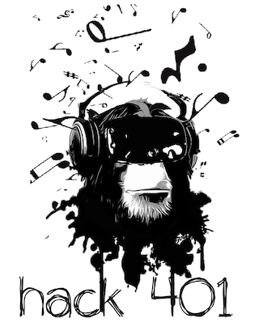

# Upcoming Hackathon – June 1st!

Spring is here, let's have a hackathon!

- *June 1, 2019 – 10:00a-7:00p*
- *[Infosys](https://www.google.com/maps/place/75+Fountain+St,+Providence,+RI+02902/@41.8243372,-71.4177514,17z/data=!3m1!4b1!4m5!3m4!1s0x89e44512321b74cd:0x1686f9ddb57cd98c!8m2!3d41.8243372!4d-71.4155574) - Downcity Providence*
- *Virtual Reality / Augmented Reality and Music Technology*
- *FREE and ACCESSIBLE for ALL participating youth*

*Please note:* Attendance will be coordinated directly with educational organizations as the event approaches.

## Workshops

The goal of hack401 is to encourage participation in computer science by showcasing fun and engaging projects on different topics. Structured workshops can be invaluable when helping create an engaging and inclusive environment for people of varying abilities and interpersonal connections. A well-planned workshop sets its participants on a course toward learning and delivering a tangible outcome for their time invested. For this first event, we are hosting four workshops around the themes of **virtual reality and music technology**.

### Virtual Reality

#### VR-A:  Recreating RI Objects
Participants will create digital versions of objects that are quintessentially Rhode Island and put them in a web page for viewing by all. This workshop will cover 3D space, scanning, the basic components of a 3D recreated object and cleaning a mesh, as well as how to work with 3D objects in HTML using A-frame, an open source framework for building VR experiences into the web. 

#### VR-B:   How to Create Virtual Tours w/Google Tour Creator
Participants in this workshop will learn how to create virtual tours using Google Tour Creator and how to share those tours via the web and VR headsets. At the end of the workshop participants will have an understanding of panoramas, virtuals tours, various virtual tour creation tools and how to reproduce the virtual tour creation experience at home.

### Music Tech

#### MT-A:  Multitrack Recording in Soundtrap 
This workshop will explore multitrack recording using SoundTrap a collaborative audio workstation. Participants will learn the basics about audio recording (microphones, digital interfaces, signals, volume / gain, panning, mixing) and sequencing (clipping, looping, arranging, editing, layering). These are the basic tools necessary to record your own music, and serves as a great exercise in seeing foundational music technology in action.

#### MT-B:  Python Programming for Music 
Ever wonder how synthesizers and digital effects work? This workshop will cover the science of sound using the Python, a user friendly programming language. Participants will get an introduction to Python by working with audio signals, through generation, visualization, and manipulation. Computers will be provided – the only requirements are determination and an excitement for music!

Please reach out to [hack401@googlegroups.com](mailto:hack401@googlegroups.com) with any questions or ideas!

## Schedule

| 9:00a | Check-in  |
| 10:00a  |  Welcome Remarks  |
| 10:15a  | Morning Session    VR-A1 – Basics of Photogrammetry   VR-B1 – Creating Virtual Tours     MT-A1 – Drum Programming and Recording   MT-B1 – Synthesizing Sounds  |
| 12:00p | LUNCH  |
| 1:00p  | Afternoon Session    VR-A2 – WebVR Basics    VR-B2 – Sharing Virtual Tours via VR & Web    MT-A2 – Looping and Arranging   MT-B2 – Digital Audio Effects  |
| 3:00p | BREAK  |
| 3:15p | Group Projects  |
| 5:00p | Presentations  |
| 6:30p | Closing Remarks and Goodbyes  |

## FAQ

### What is a Hackathon?
A “hack” “marathon”, is where people create a project or product along some kind of theme. This is done in a concentrated amount of time. [Wikipedia](https://en.wikipedia.org/wiki/Hackathon) has a decent overview of hackathons in general but ours is a bit unique.

### What is the goal of hack401?
The goal of hack401 is to encourage participation in computer science by showcasing fun and engaging projects on different topics. Structured workshops can be invaluable when helping create an engaging and inclusive environment for people of varying abilities and interpersonal connections. A well-planned workshop sets its participants on a course toward learning and delivering a tangible outcome for their time invested. For this first event, we are hosting four workshops around the themes of virtual reality / augmented reality and music technology.

### Who should attend?
Anyone in high school between ages 14--19 in RI. No experience or prior tech knowledge necessary. We will accommodate youth from all backgrounds and skill sets!

### What do I bring?
Bring a cell phone, laptop, tablet, headphones and their chargers and of course your imagination. If you do not have any of this tech, no worries, we’ll bring extra :D.

### How do I form or join a team and why?
hack401 is exploring two themes, Music Technology and Virtuality Reality. The week leading up to the event we will reveal the projects you could work on within in either category and give you the power to choose. Teams will be mixed with students from around the entire state. At the end of the day, teams will share what they’ve built. 

### Who owns my final project?
YOU DO! 

## About

**hack401** seeks to build awareness of the latest tech, access and opportunities to learn and make, and create connections in our very active community.

**hack401** is made possible with with a coalition of partners including [Citizens Bank](https://www.citizensbank.com), [Institute of Entrepreneurship & Leadership (IEL)](https://ieleadership.org/
), [Rhode Island Virtual Reality (RIVR)](https://www.facebook.com/rhodeislandvr/), [STEAM Box](https://www.facebook.com/STEAMBoxRI/) and [Microsoft Philanthropies TEALS](https://www.tealsk12.org).

### Getting Involved!

You've heard about what we're doing. You love what you're experiencing. You and/or your organization want to sponsor/host/lead a workshop. Please [reach out](mailto:hack401@googlegroups.com) with your information and we'll be in touch:

* First and Last Name
* Organization
* Your interests, e.g. workshop lead, sponsor, hosting, or something else

Our vision is for hack401 to continue to thrive as a regular community run event, building awareness and access to the latest tech, access and opportunities to learn and make, and create connections in our very active community.

Thanks so much for your interest! 